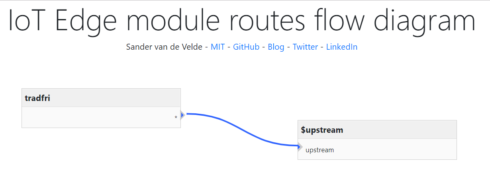
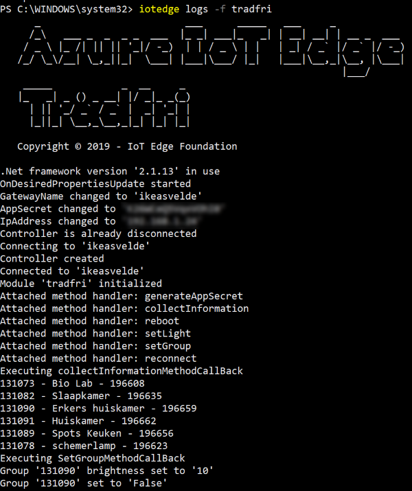

# iot-edge-tradfri

Azure IoT Edge support for IKEA Trådfri/Tradfri. The logic is limited to lights.

# IoT Edge

This logic is available as [Docker container](https://hub.docker.com/repository/docker/svelde/iot-edge-tradfri).

This Docker module is optimized for [Azure IoT Edge](https://docs.microsoft.com/en-us/azure/iot-edge/).



# Current limitations

At this moment, the module supports:

* Generating a private key for the module
* Overview of all rooms and it's device
* Reboot (untested)



# Usage

## 1. Initialization

## 2. Controlling lights

# Interface

## Desired and reported properties

The following properties are used:

* gatewayName (required; choose a name)
* ipAddress (required; the IP address of the Trådfri hub)
* appSecret (required; generate this with appropriate Direct Method)

## Direct Methods

The following Direct Methods are offered:

* generateAppSecret

### generateAppSecret

The input is:

```
public class GenerateAppSecretCommand
{
  public string gatewaySecret {get; set;}
}
```

*Note*: The gateway secret can be found on the back of your Trådfri hub.

The output is :

```
public class GenerateAppSecretResponse
{
  public string appSecret {get; set;}
}
```

Fill in this appSecret in the related Desired Property.

## collectInformation

The input is empty:

```
{}
```

The output is:

```
public class CollectInformationResponse : CollectedInformation
{
  public int responseState { get; set; }
}

public class CollectedInformation
{
  public CollectedInformation()
  {
    groups = new List<Group>();
  }      

  public List<Group> groups {get; private set;}
}

public class Group
{
  public long id { get; set; }

  public string name { get; set; }
  public long lightState { get; set; }

  public long activeMood {get; set;}

  public List<Device> devices {get; private set;}

  public Group()
  {
    devices = new List<Device>();
  }
}

public class Device
{
  public long id { get; set; }

  public string deviceType { get; set; }

  public string deviceTypeExt { get; set; }

  public string name { get; set; }

  public long battery { get; set; }

  public DateTime lastSeen { get; set; }

  public string reachableState { get; set; }

  public long dimmer { get; set; }

  public string state { get; set; }

  public string colorHex { get; set; }
}
```

## reboot

The input is empty:

```
{}
```

The output is:

```
public class RebootResponse
{
  public int responseState { get; set; }
}
```

*Note*: It's unclear if this method is actully doing anything... 

# Aknowledgement

The logic in this module is based on https://github.com/tomidix/CSharpTradFriLibrary

# Disclaimer

This module is trying to honor all rights of Ikea regarding Trådfri.  
