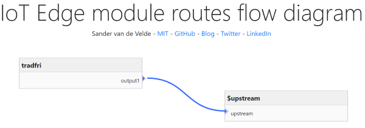

# iot-edge-tradfri

Azure IoT Edge support for IKEA Trådfri/Tradfri. The functionality is limited to lights for now.

# IoT Edge

This IoT Edge module is available as [Docker container](https://hub.docker.com/repository/docker/svelde/iot-edge-tradfri).

This Docker module is optimized for [Azure IoT Edge](https://docs.microsoft.com/en-us/azure/iot-edge/):

```
docker pull svelde/iot-edge-tradfri:0.3.1-windows-amd64
docker pull svelde/iot-edge-tradfri:0.3.1-arm32v7
docker pull svelde/iot-edge-tradfri:0.3.1-amd64
```

*Note*: This module is tested using the amd64 version. The working of the confirmed for the Raspberry PI version (arm32).



# Supported features 

At this moment, the module supports:

* Generating a private key for the module/application
* Connecting to Hub when right properties are filled in
* Reboot Hub / Reconnect to the hub
* Overview of all groups and the devices in these groups or of filtered groups
* Curren state, brightness, and color (hexadecimal) of lights
* Set color/brightness/state of light
* Set color/brightness of group of lights
* Events/changes are shown

## Work in progress

This is a work in progress. Please support with:

* Mood is not supported by groups
* Stability
* Bug fixes


# Usage

## 1. Initialization

Fill in the desired properties:

* gatewayName (required; choose a name)
* ipAddress (required; the IP address of the Trådfri hub)

Then call the "generateAppSecret" direct method. Pass the "gateway secret", found on the back of your Trådfri hub.

*Note*: the name of the module will be used as the application name.

The returned "application secret" has to be filled in in the desired property:

* appSecret

## 2. Controlling lights

Lights can be controlled individually or as a group. 

State, brightness, and color can be set. Mood is not available yet.

# Interface

## Desired and reported properties

The following properties are used:

* gatewayName (required; choose a name)
* ipAddress (required; the IP address of the Trådfri hub)
* appSecret (required; generate this with appropriate Direct Method)

## Direct Methods

The following Direct Methods are offered:

* generateAppSecret

### generateAppSecret

The input is:

```
public class GenerateAppSecretRequest
{
  public string gatewaySecret {get; set;}
}
```

*Note*: The gateway secret can be found on the back of your Trådfri hub.

The output is :

```
public class GenerateAppSecretResponse
{
  public string appSecret {get; set;}
  public string errorMessage { get; set; }
}
```

Fill in this appSecret in the related Desired Property.

## collectInformation

Collection information can take up to a few minutes. Please adjust the timeout settings accordingly.

The input format is empty:

```
{
  "filter": "[Group IDs]"
}
```

You can pass Group IDs (separated by some separator) to filter the list of groups. 

The output format is:

```
public class CollectInformationResponse : CollectedInformation
{
  public int responseState { get; set; }
}

public class CollectedInformation
{
  public Dictionary<long, Group> groups {get; private set;}
}

public class Group
{
  public string name { get; set; }
  public long lightState { get; set; }
  public long activeMood {get; set;}
  public Dictionary<long, Device> devices {get; private set;}
}

public class Device
{
  public string deviceType { get; set; }
  public string deviceTypeExt { get; set; }
  public string name { get; set; }
  public long battery { get; set; }
  public DateTime lastSeen { get; set; }
  public string reachableState { get; set; }
  public long dimmer { get; set; }
  public string state { get; set; }
  public string colorHex { get; set; }
  public string serial { get; set; }
  public string firmwareVersion { get; set; }
  public string powerSource { get; set; }  
}
```

### Example

This is an example of the response:

```
{
	"status": 200,
	"payload": {
		"responseState": 0,
		"groups": {
		           131090: {
				"name": "Main room",
				"lightState": 0,
				"activeMood": 196659,
				"devices": {
				        65593: {
						"deviceType": "Remote",
						"deviceTypeExt": "TRADFRI remote control",
						"name": "Remote main room",
						"battery": 34,
						"lastSeen": "2019-11-12T21:33:32Z",
						"reachableState": "1",
						"dimmer": 0,
						"state": null,
						"colorHex": null,
						"serial": "",
						"firmwareVersion": "2.3.014",
						"powerSource": "InternalBattery"
					}, 
					65594: {
						"deviceType": "Light",
						"deviceTypeExt": "TRADFRI bulb GU10 WS 400lm",
						"name": "My mood light",
						"battery": 0,
						"lastSeen": "2019-11-12T19:58:08Z",
						"reachableState": "0",
						"dimmer": 220,
						"state": "True",
						"colorHex": "f1e0b5",
						"serial": "",
						"firmwareVersion": "2.0.022",
						"powerSource": "InternalBattery"
					}
				}
			}
		}
	}
}

```

## reboot

The input is empty:

```
{}
```

The output is:

```
public class RebootResponse
{
  public int responseState { get; set; }
  public string errorMessage { get; set; }
}
```

*Note*: After this method is sent, the Hub is actually rebooting. This takes some time. You have to reconnect later before you can continue to work with the hub.

## Reconnect

Sometimes other direct methods result in a timeout. The most likely reason is that another application has changed the properties of a device. In that case, reconnect using this method.

The input is empty:

```
{}
```

The output is:

```
public class ReconnectResponse
{
  public int responseState { get; set; }
  public string errorMessage { get; set; }
}
```

## SetLight

The input is:

```
public class SetLightRequest
{
  public long id { get; set; }
  public bool? turnLightOn { get; set; }
  public string color { get; set; }
  public int? brightness { get; set; }
}
```

The output is:

```
public class SetLightResponse
{
  public int responseState { get; set; }
  public string errorMessage { get; set; }
}
```

## SetGroup

The input is:

```
public class SetLightRequest
{
  public long id { get; set; }
  public bool? turnLightOn { get; set; }
  public int? brightness { get; set; }
}
```

The output is:

```
public class SetGroupResponse
{
  public int responseState { get; set; }
  public string errorMessage { get; set; }
}
```

# Routing events

Changes/events on devices are made available as messages on route 'output1'.

This is the format:

```
[IoTHubMonitor] [11:24:43 PM] Message received from [edgedevice/tradfri]:
{
  "id": 65589,
  "name": "Bulb living room",
  "state": "True",
  "brightness": 86,
  "color": "efd275"
  "groupId": 1234,
  "groupName": "Living room"
}
```

# Acknowledgment

The logic in this module is based on https://github.com/tomidix/CSharpTradFriLibrary.

# Disclaimer

This module is trying to honor all rights of Ikea regarding Trådfri.
